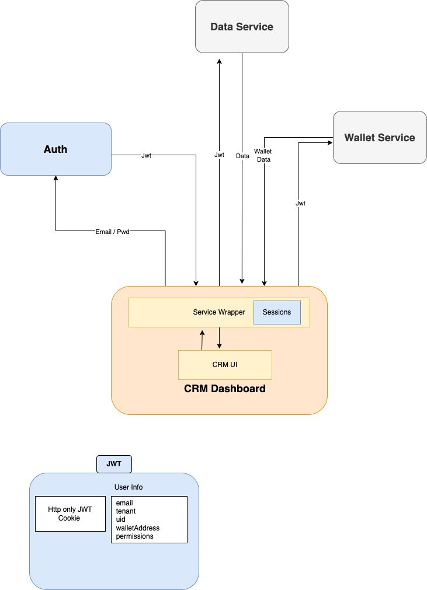

# Authentication Flow


#### Endpoint
```POST /auth```

#### Schema

```ts
{
    _type:  'google' | 'emailPass' | 'wallet',
    email: string,
    password: string
}
```


 #### Response 
```ts 
{
    responseCode: 200,
    data: {
         "jwt": "eyJhbGciOiJSUzI1NiJ9. ..."
    },

}
```

 #### Flow diagram


