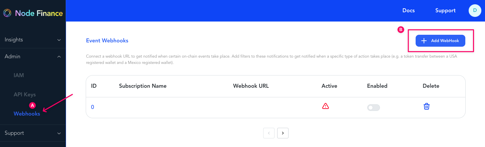
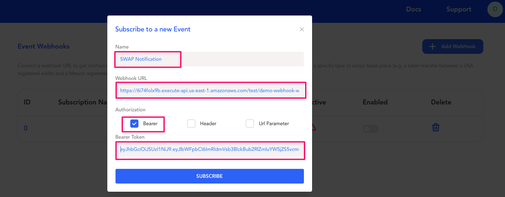
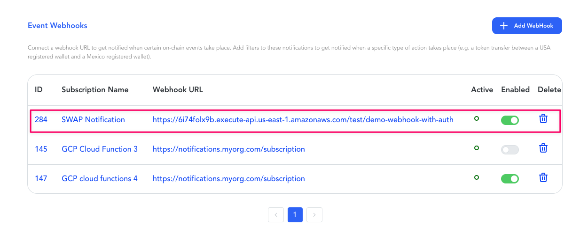

# Create Webhooks from console

**Connect** a webhook URL to get notified when certain on-chain events take place. Add filters to these notifications to get notified when a specific type of action takes place (e.g. a token transfer between a USA registered wallet and a Mexico registered wallet).

#### Add

#### Webhooks Modal
 Enter the Webhooks inputs needed for creation 
 * **name**, 
 * callback **URL**, 
 * **authentication** type 
 * and optional **Bearer token**

#### Created a new subscription

